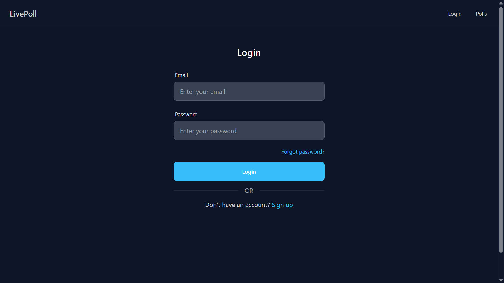

<div align="center">
    <h1>Pollora<br>Real-Time Polling & Discussion Platform</h1>
</div>

Pollora is a full-featured interactive web application that enables users to create, participate in, and manage polls with real-time updates. Beyond live voting, it supports real-time comment threads and interactive debates, offering a seamless and engaging experience for users to express opinions, discuss ideas, and view live results with instant feedback.

## Features

- Users can **sign up and log in** securely using cookie-based authentication with JWT.
- Browse polls created by other users in a **paginated** format.
- **Vote in polls** and view live results using `Socket.io` and dynamic charts.
- **Bookmark polls** and view them later on a dedicated bookmarks page.
- Access a **personal dashboard** to manage your profile and polls.
- Easily **create new polls** with multiple options using an intuitive UI.
- Real-time notifications using `react-toastify` for feedback on user actions.
- Visualize poll results with live charts powered by `chart.js`.
- Clean, responsive UI styled using `TailwindCSS` and `ShadCN`.

## Preview Images

### Home Page


### Polls Page


### Login Page



### Signup Page


### Poll Votting Page


### Dashboard Page


### Create Poll Page


## Tech Stack

### Frontend

Framework & Routing: `ReactJS`, `React Router`  
State Management: `React Query`
Real-Time Communication : `Socket.io-client`
Charts: `react-chartjs-2`
Styling: `TailwindCSS`, `ShadCN`
Notifications: `React-Toastify`
Icons: `React Icons`

### Backend

Framework: `Node.js`, `Express.js`
Authentication: `JWT`, `bcrypt`  
Validation : `Zod`
Documentation: `Swagger-jsdoc`  
Real-Time Communication: `Socket.io`  
Database & ORM: `MonodoDB`, `Mongoose`

### Others

API Communication: `Axios`

## Installation and Setup

### Prerequisites

- Node.js and npm/yarn installed.
- MongoDB database set up locally or on a cloud provider.

### Steps

1. Clone the Repository

   ```bash
   git clone https://github.com/vedpatel7/Pollora.git
   cd Pollora
   ```

2. Backend Setup

   - Navigate to the backend directory:
     ```bash
     cd backend
     ```
   - Install dependencies:
     ```bash
     npm install
     ```
   - Create a `.env` file and add the following:
     ` PORT=3000
DB_CONNECTION="your mongodb url"
SALT_ROUNDS=6
JWT_PRIVATE="your jwt private key"
CLIENT_URL="your client url"`
   - Start the server:
     ```bash
     npm run dev
     ```

3. Frontend Setup

   - Navigate to the frontend directory:
     ```bash
     cd frontend
     ```
   - Install dependencies:
     ```bash
     npm install
     ```
   - Start the development server:
     ```bash
     npm run dev
     ```

4. Access the Application

- Navigate to the `frontend` directory and run `npm run dev` to start the development server.
- Navigate to the `backend` directory and run `npm run dev` to start the server.
- Open a browser and go to `http://localhost:5173` to access the application.

---

## Future Improvements

- Add Real-time comment threads
- sorting polls using created date and popularity.
- Multiple question poll.
- Real-Time Debate
